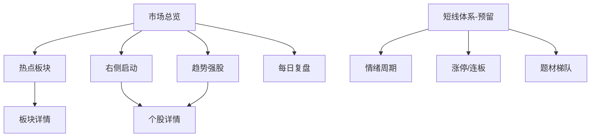
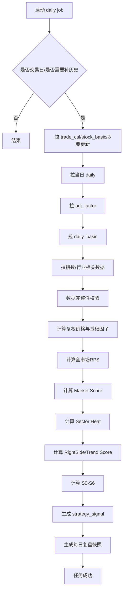

# A股机会发现与趋势研究系统 PRD

**版本**：V1.0  
**日期**：2026-08-25  
**产品定位**：面向个人投研的 A 股日线级“市场理解 + 热点识别 + 趋势发现 + 机会池压缩”系统  
**主数据源**：Tushare Pro  
**核心运行方式**：交易日收盘后运行一次；支持本地电脑手动运行、定时运行和后续迁云  

---

## 1. 产品背景

A 股股票数量超过 5000 只，个人投资者无法在每日收盘后逐一阅读全部 K 线、板块变化和相对强弱。传统行情软件通常提供涨幅榜、板块榜、资金榜和单股技术指标，但用户仍需自行完成：

1. 判断当前市场环境是否适合做趋势；
2. 判断近期真正的热点/主线板块，而非只看单日涨幅；
3. 从全市场发现“左侧下跌/筑底 -> 右侧确认”的股票；
4. 识别已经形成持续趋势的强势股；
5. 把“热点板块”和“强势个股”交叉，形成更小的重点观察池；
6. 记录系统历史判断，用数据验证策略是否有效。

因此，本产品不定位为实时交易终端，也不直接给出“买入/卖出”结论，而定位为：

> **A 股机会发现与趋势研究系统：由机器完成 5000+ -> 10~30 只候选的压缩，由用户完成最终研究和交易决策。**

---

## 2. 产品目标

### 2.1 V1 核心目标

V1 每个交易日收盘后自动回答以下问题：

1. **市场怎么样？** 当前是强势、震荡还是弱势环境？
2. **市场在炒什么？** 当前最热的行业/板块是什么，哪些正在升温、主升、分歧、退潮？
3. **哪些股票刚从左侧转右侧？** 今日哪些股票从筑底状态进入右侧确认状态？
4. **哪些股票已经形成趋势？** 全市场当前最强的趋势股有哪些？
5. **哪些股票同时满足热点 + 趋势共振？**
6. **今天相较昨天发生了什么变化？** 包括市场状态、板块热度排名、股票状态跃迁和新增/退出候选。

### 2.2 V1 成功标准

- 每个交易日可完成全 A 股数据更新和计算；
- 5000+ 股票经过筛选后，最终重点观察池原则上控制在 5~30 只；
- 每只入选股票必须给出结构化“入选原因”，禁止黑盒结果；
- 每个交易日保存因子、状态、信号，能够回看任意历史日期当时系统的判断；
- 能对“右侧确认”信号做 5/10/20/60 个交易日的后验统计；
- 系统规则可配置，不把阈值硬编码到业务代码中；
- 本地部署与未来阿里云部署使用同一套 Docker 化架构。

### 2.3 非目标（V1 不做）

- 不做盘中高频或 Level-2 实时交易；
- 不做自动下单；
- 不做收益承诺或确定性涨跌预测；
- 不以大模型直接预测个股涨跌；
- 不把新闻/研报 NLP 作为 V1 主筛选依据；
- 不在 V1 实现完整短线打板系统，仅预留模块和数据结构。

---

## 3. 用户与核心使用场景

### 3.1 目标用户

首期为单用户本地使用：具备一定技术分析/股票研究能力，希望每天收盘后快速完成市场复盘和趋势机会发现。

### 3.2 核心场景

#### 场景 A：收盘后快速判断市场

用户打开首页，希望在 1 分钟内知道：

- 市场状态：RISK_ON / NEUTRAL / RISK_OFF；
- 市场综合分；
- 上涨家数比例；
- MA20/MA60 以上股票比例；
- 新高/新低数量；
- 成交活跃度；
- 与上一交易日相比是改善还是恶化。

#### 场景 B：发现热点板块

用户希望知道：

- 热度 TOP20 板块；
- 每个板块当前生命周期；
- 1/3/5/20 日收益与相对基准超额；
- 板块内部上涨广度、趋势广度、新高比例；
- 热度变化率 Heat Momentum；
- 哪些板块是“刚启动/快速升温”，而不是已经高潮。

#### 场景 C：发现刚右侧确认的股票

用户希望系统自动找到：

- 昨日处于 S1/S2、今日首次进入 S3 的股票；
- RightSide Score；
- 触发原因，如“20 日平台突破、MA20 拐头、RPS 加速、量能确认”；
- 所属板块及板块热度；
- 排除 ST、长期停牌、新股、低流动性标的。

#### 场景 D：查看当前趋势强股

用户希望看到：

- Trend Score TOP N；
- RPS20 / RPS60 / RPS120；
- 趋势状态 S4/S5；
- 所属板块和热点共振程度；
- 最大回撤、趋势效率、均线结构等解释性指标。

#### 场景 E：每日变化复盘

系统自动展示：

- 新进入 S3 的股票；
- S3 -> S4、S4 -> S5 的股票；
- S4/S5 -> S6 的趋势衰退股票；
- 新进入板块热度 TOP10 的行业；
- 板块状态由“观察 -> 启动”“升温 -> 主升”“主升 -> 分歧”等变化。

---

## 4. 产品总体信息架构

V1 页面：

1. 市场总览 Dashboard
2. 热点板块
3. 右侧启动
4. 趋势强股
5. 个股详情
6. 每日复盘
7. 系统运行/数据状态

P2 预留：短线情绪、涨停梯队、题材龙头、AI 复盘。

---

## 5. 全局股票池规则

系统所有趋势计算先建立 Eligible Universe，可配置：

### 5.1 默认排除

- 已退市股票；
- 当日停牌且无行情数据；
- 名称包含 `ST` 或 `*ST`；
- 上市交易日不足 120 个交易日；
- 最近 20 日平均成交额低于 5000 万元（配置项）；
- 可选：收盘价低于 2 元；
- 数据缺失超过允许阈值的股票。

### 5.2 配置要求

所有过滤阈值写入 `config/strategy.yaml`，前端后续可配置，V1 不要求做配置页面。

---

## 6. 市场环境模块（Market Regime）

### 6.1 页面输出

首页展示：

- Market Score：0~100；
- Market Regime：RISK_ON / NEUTRAL / RISK_OFF；
- 市场状态相较昨日变化；
- 主要指数 1/5/20 日表现；
- Breadth20：收盘价高于 MA20 的股票比例；
- Breadth60：收盘价高于 MA60 的股票比例；
- NewHigh20 / NewLow20 数量；
- 上涨家数、下跌家数、涨跌比；
- 全市场成交额及 Amount20 Ratio；
- 可选短线指标：涨停/跌停数量。

### 6.2 Market Score V1

各子分数先统一映射到 0~100，再加权：

| 因子 | 权重 | 说明 |
|---|---:|---|
| Index Trend Score | 25% | 沪深300、中证1000、上证指数趋势综合 |
| Breadth Score | 30% | MA20/MA60 以上股票比例 |
| Advance/Decline Score | 15% | 上涨股票比例、涨跌比 |
| New High/Low Score | 15% | 20/60 日新高新低结构 |
| Liquidity Score | 15% | 全市场成交额相对 20 日均值 |

`MarketScore = 0.25*IndexTrend + 0.30*Breadth + 0.15*AD + 0.15*NewHighLow + 0.15*Liquidity`

默认状态：

- `RISK_ON`: MarketScore >= 70
- `NEUTRAL`: 45 <= MarketScore < 70
- `RISK_OFF`: MarketScore < 45

阈值全部可配置，后续以回测优化。

---

## 7. 热点板块模块（Sector Heat）

### 7.1 V1 板块口径

**主口径：申万行业一级/二级。**

原因：分类稳定、成分可追溯、易于历史回测。概念板块作为增强层，不作为 V1 成功运行的硬依赖。

### 7.2 板块核心因子

对每个交易日、每个行业计算：

- Return1 / Return3 / Return5 / Return20；
- ExcessReturn5 = SectorReturn5 - BenchmarkReturn5；
- ExcessReturn20；
- Breadth20 = 成分股 close_adj > MA20 的比例；
- Breadth60；
- UpRate = 当日上涨成分股比例；
- NewHigh20Rate = 20 日新高股票比例；
- RPS60Median = 成分股 RPS60 中位数；
- RPS60Top20Rate = RPS60 >= 80 的成分股比例；
- AmountRatio20 = 板块当日成交额 / 板块 20 日平均成交额；
- LimitUpDensity（可选）= 涨停股数 / 有效成分股数；
- MoneyFlowScore（可选）= 板块资金流截面分位数。

### 7.3 Sector Heat Score V1

核心指标在**当日板块截面内做 percentile rank**，统一为 0~100，避免固定涨幅阈值在不同市场环境下失真。

默认权重：

| 因子 | 权重 |
|---|---:|
| 5日超额收益分位 | 20% |
| 20日超额收益分位 | 15% |
| Breadth20 分位 | 15% |
| Breadth60 分位 | 10% |
| NewHigh20Rate 分位 | 10% |
| RPS60Median 分位 | 10% |
| AmountRatio20 分位 | 10% |
| 当日上涨率分位 | 5% |
| 资金/涨停增强因子 | 5% |

如果可选数据不可用，剩余权重按比例归一化。

### 7.4 Heat Momentum

- `HeatMomentum1 = Heat_t - Heat_t-1`
- `HeatMomentum3 = Heat_t - Heat_t-3`
- `RankChange = Rank_t-1 - Rank_t`，正值表示排名提升。

产品重点展示 `Heat` 和 `HeatMomentum3`，因为“正在升温”往往比“绝对热度最高”更值得观察。

### 7.5 板块生命周期 V1

生命周期判断按优先级执行：

1. **高潮 CLIMAX**：Heat >= 90 且 Breadth20 >= 80% 且 5 日收益分位 >= 90；
2. **分歧 DIVERGENCE**：Heat >= 70 且 HeatMomentum3 <= -8；
3. **主升 MAIN_UP**：Heat >= 75 且 HeatMomentum3 >= 0；
4. **升温 HEATING**：Heat >= 60 且 HeatMomentum3 > 5；
5. **启动 STARTING**：上一交易日 Heat < 55，今日 Heat >= 55 且 HeatMomentum3 >= 10；
6. **观察 WATCH**：40 <= Heat < 60；
7. **退潮 COOLING**：Heat < 60 且 HeatMomentum3 < 0；
8. **冷却 COLD**：Heat < 40。

阈值必须配置化。

---

## 8. 个股因子体系

### 8.1 价格统一口径

原始 OHLCV 永久保存。趋势计算使用复权价格：

- `adj_close = close * adj_factor`
- `adj_open = open * adj_factor`
- `adj_high = high * adj_factor`
- `adj_low = low * adj_factor`

采用乘复权因子的稳定序列用于趋势计算；因子以比例/排名为主，不依赖价格绝对值。

### 8.2 基础技术因子

每个股票每日计算：

- MA5 / MA10 / MA20 / MA60 / MA120 / MA250；
- Return5 / Return20 / Return60 / Return120 / Return250；
- MA20Slope5 = `(MA20_t / MA20_t-5 - 1) / 5`；
- MA60Slope10；
- ATR14、ATR20、ATR20Pct = ATR20 / adj_close；
- AmountMA20；
- AmountRatio20 = amount / AmountMA20；
- High20 / High60 / High120；
- Low20 / Low60；
- DrawdownFromHigh60 / 120；
- MaxDrawdown60；
- TrendEfficiency20 = `abs(close_t/close_t-20 - 1) / sum(abs(daily_return), 20)`；
- HigherLowScore；
- Breakout20 / Breakout60；
- DistanceToMA20 / 60 / 120；
- DistanceToHigh60 / 120。

### 8.3 RPS 相对强度

对 Eligible Universe 计算：

- `RPS20 = percentile_rank(Return20) * 100`
- `RPS60 = percentile_rank(Return60) * 100`
- `RPS120 = percentile_rank(Return120) * 100`
- `RPS250 = percentile_rank(Return250) * 100`

同时计算：

- RPS20Delta5 = RPS20_t - RPS20_t-5；
- RPS60Delta5；
- RelativeReturn20 = StockReturn20 - BenchmarkReturn20；
- RelativeReturn60。

### 8.4 突破定义

为避免把当天最高价本身包含进滚动高点：

- `PrevHigh20 = max(adj_high[t-20:t-1])`
- `Breakout20 = adj_close_t > PrevHigh20`
- `PrevHigh60 = max(adj_high[t-60:t-1])`
- `Breakout60 = adj_close_t > PrevHigh60`

可增加近突破：`adj_close / PrevHigh20 >= 0.98`。

### 8.5 Higher Low

V1：

`HigherLow = min(adj_low[t-19:t]) > min(adj_low[t-59:t-20])`

并保存两段低点的涨幅百分比。

---

## 9. RightSide Score（右侧启动评分）

目标：寻找“过去弱/筑底，当前开始被市场确认”的股票，而不是单纯寻找已经涨很多的股票。

默认权重：

| 子因子 | 权重 | 规则示例 |
|---|---:|---|
| Breakout Score | 20% | 20/60 日平台突破或接近突破 |
| MA20 Turn Score | 15% | MA20 由下行 -> 走平 -> 上行 |
| MA Recovery Score | 15% | 重新站上 MA20/MA60 |
| RPS Acceleration | 20% | RPS20、RPS60 快速提升 |
| Volume Confirmation | 10% | AmountRatio20 >= 1.2 等 |
| Higher Low | 10% | 中短期低点抬升 |
| Volatility Structure | 10% | 筑底期波动收敛、突破时波动扩张 |

输出 0~100。

默认 S3 候选要求：

- RightSideScore >= 70；
- adj_close > MA20；
- MA20Slope5 > 0；
- `Breakout20 = true` **或** 当日由下向上穿越 MA60；
- RPS20 >= 70；
- 不触发全局股票池排除条件。

---

## 10. Trend Score（趋势强度评分）

Trend Score 只衡量个股自身趋势质量，**不掺入板块热度**，避免后续综合评分重复计权。

默认权重：

| 子因子 | 权重 |
|---|---:|
| RPS20 | 15% |
| RPS60 | 25% |
| RPS120 | 15% |
| 均线结构 MA Structure | 15% |
| MA20/MA60 斜率 | 10% |
| Trend Efficiency | 10% |
| Drawdown Quality | 10% |

其中 MA Structure 可按以下方式打分：

- close > MA20：25 分；
- MA20 > MA60：25 分；
- MA60 > MA120：25 分；
- MA20/MA60 均向上：25 分。

最终映射 0~100。

---

## 11. 股票趋势状态机

### 11.1 状态定义

| 状态 | 名称 | 产品含义 |
|---|---|---|
| S0 | DOWN | 明确下跌趋势 |
| S1 | DECELERATING | 下跌减速/弱势修复 |
| S2 | BASE | 筑底/震荡，趋势未确认 |
| S3 | RIGHT_CONFIRMED | 右侧首次确认 |
| S4 | TREND | 趋势形成 |
| S5 | MAIN_UP | 强趋势/主升 |
| S6 | DECAY | 趋势衰退 |

### 11.2 V1 判定建议

#### S0 DOWN
满足多数条件：

- close < MA60；
- MA20 < MA60；
- MA20Slope5 < 0；
- RPS60 < 50。

#### S1 DECELERATING

- 仍未形成上升趋势；
- MA20Slope5 相较 5 日前明显改善；或 close 重回 MA20；
- 最近 20 日不再持续创新低；
- RPS20Delta5 > 0。

#### S2 BASE

- 不满足 S0；
- MA20 走平或轻微向上；
- close 与 MA60 距离在可配置区间（默认 ±10%）；
- 20 日价格区间收敛，或 HigherLow 为真；
- 未达到 S3 条件。

#### S3 RIGHT_CONFIRMED

- RightSideScore >= 70；
- close > MA20；
- MA20Slope5 > 0；
- Breakout20 或 CrossAboveMA60；
- RPS20 >= 70；
- S3 作为“刚确认状态”，默认最长保留 5 个交易日，随后进入 S4/S2/S6。

#### S4 TREND

- close > MA20 > MA60；
- MA20Slope5 > 0；
- MA60Slope10 >= 0；
- RPS60 >= 70；
- TrendScore >= 70。

#### S5 MAIN_UP

- TrendScore >= 85；
- RPS60 >= 90；
- RPS120 >= 80；
- close > MA20 > MA60 > MA120；
- 60 日最大回撤不超过可配置阈值。

#### S6 DECAY

从 S3/S4/S5 进入，满足任一强衰退或多个弱衰退：

- 连续 2 日 close < MA20；
- MA20Slope5 < 0；
- RPS20 < 50；
- TrendScore 较 5 日前下降 >= 20；
- 跌破关键 20/60 日结构位。

### 11.3 状态优先级

每日分类优先级：`S5 -> S4 -> S3 -> S6 -> S0 -> S1 -> S2`，同时结合 `previous_state` 约束非法跳转。

禁止无解释地从 S0 直接跳到 S5；即使因极端涨停导致条件满足，也先记为 S3，并记录 `fast_transition=true`。

---

## 12. 综合机会评分 Opportunity Score

最终候选池需要把个股与板块、市场结合：

`OpportunityScore = 0.45*StockScore + 0.35*SectorHeat + 0.10*SectorHeatMomentumScore + 0.10*MarketScore`

其中：

- 对 S3 股票，`StockScore = RightSideScore`；
- 对 S4/S5 股票，`StockScore = TrendScore`。

页面必须同时显示原始分项，禁止只显示综合分。

---

## 13. 页面需求

### 13.1 市场总览

模块：

1. 日期、最后更新时间、数据完整状态；
2. Market Regime 卡片；
3. 市场宽度；
4. 主要指数；
5. 热点板块 TOP10；
6. 今日新 S3 股票 TOP10；
7. 趋势强股 TOP10；
8. 今日关键变化。

验收：用户不进入二级页，也能在首页理解当天市场主线和系统发现的核心机会。

### 13.2 热点板块

列表列：

- 行业名称；
- Heat；
- HeatMomentum1/3；
- Rank / RankChange；
- Lifecycle；
- Return1/5/20；
- Breadth20/60；
- NewHigh20Rate；
- RPS60Median；
- AmountRatio20。

支持按 Heat、HeatMomentum3、RankChange 排序。

### 13.3 右侧启动

默认只显示今日 `state=S3` 且 `is_new_state=true`。

字段：

- 股票代码/名称；
- RightSideScore；
- OpportunityScore；
- 昨日状态 -> 今日状态；
- RPS20/60；
- Breakout20/60；
- AmountRatio20；
- 所属行业；
- SectorHeat；
- 入选原因标签。

### 13.4 趋势强股

默认显示 S4/S5，按 TrendScore 降序：

- TrendScore；
- RPS20/60/120；
- 状态；
- 状态持续天数；
- 20/60 日收益；
- 60 日最大回撤；
- TrendEfficiency；
- SectorHeat；
- OpportunityScore。

### 13.5 个股详情

顶部：状态、RightSideScore、TrendScore、OpportunityScore、RPS、所属板块、SectorHeat。

图表：

- 日 K + MA20/60/120；
- S0~S6 状态带；
- S3 信号标记；
- RPS20/60/120 曲线；
- RightSideScore / TrendScore 曲线；
- 成交额及 AmountRatio20。

历史表：最近 60 个交易日状态变化。

### 13.6 每日复盘

自动生成结构化内容：

- 市场状态变化；
- 板块 Top10 和新进入 Top10；
- 今日新 S3；
- S3 -> S4；
- S4 -> S5；
- 进入 S6；
- 退出重点观察池；
- 昨日候选今日表现。

V1 可先模板化文本，P2 再接 LLM 生成自然语言总结。

### 13.7 系统运行状态

展示：

- 最近交易日；
- 数据库最新 trade_date；
- 每张事实表最新日期；
- 当日股票行情条数；
- 因子计算条数；
- 状态计算条数；
- 任务执行状态、耗时、错误信息；
- 手动执行“补数据/重算因子/重算状态”。

---

## 14. 每日运行流程

要求：

- 所有任务幂等；
- 同日期重复运行不得产生重复主键；
- 支持指定 `trade_date` 重跑；
- 支持从数据库最后日期自动补缺；
- 某可选数据源失败不能阻断核心链路；
- 核心行情缺失则禁止生成当天最终信号。

---

## 15. 历史回填与回测

### 15.1 初始化

默认首次回填最近 5 年交易日；支持配置 10 年。

顺序：

1. `sync-basic`：同步 `stock_basic`、申万行业分类和申万行业成分，不触发计算；
2. `backfill`：同步交易日历、日线、复权因子、daily_basic 和指数日线，不触发计算；
3. `recalculate`：按因子、市场温度、行业热度、趋势状态、策略信号和可选后验评估顺序计算。

`backfill` 启动前必须确认 `stock_basic` 至少具备 `L` 当前上市和 `D` 退市状态；缺失时提示先执行 `sync-basic`。回填失败后重跑同一日期范围时，系统按 Raw 数据集逐项判断完整性，完整数据集跳过，不完整数据集补拉。

### 15.2 信号后验统计

对每个 S3 信号保存未来收益评估（注意不能反写到当日可见特征中）：

- ForwardReturn5；
- ForwardReturn10；
- ForwardReturn20；
- ForwardReturn60；
- MFE20（20 日最大有利涨幅）；
- MAE20（20 日最大不利跌幅）。

V1 验证指标：

- S3 信号数量；
- 5/10/20/60 日平均、中位收益；
- 正收益比例；
- 分板块热度区间统计；
- 分 Market Regime 统计；
- 按 RightSideScore 分组统计。

---

## 16. 数据源需求

### 16.1 P0 必需接口

| 数据 | Tushare API | 用途 |
|---|---|---|
| 交易日历 | `trade_cal` | 判断交易日、补数 |
| 股票基础 | `stock_basic` | 股票池、上市日期、状态 |
| A股日线 | `daily` | OHLCV 核心行情 |
| 复权因子 | `adj_factor` | 复权趋势计算 |
| 每日指标 | `daily_basic` | 换手、市值、估值、量比等 |
| 指数日线 | `index_daily` | 市场环境/基准 |
| 申万行业分类 | `index_classify` | 板块维度 |
| 申万行业成分 | `index_member_all` | 股票-行业映射 |

### 16.2 P1 增强接口

| 数据 | API | 用途 |
|---|---|---|
| 同花顺板块行情 | `ths_daily` | 概念/行业板块增强 |
| THS行业资金 | `moneyflow_ind_ths` | Sector Heat 增强 |
| DC板块资金 | `moneyflow_ind_dc` | Sector Heat 增强 |
| THS个股资金 | `moneyflow_ths` | 个股增强因子 |

### 16.3 P2 短线预留

| 数据 | API | 用途 |
|---|---|---|
| 涨跌停池 | `limit_list_ths` | 涨停、连板、炸板、跌停 |
| 最强概念 | `limit_cpt_list` | 短线题材/板块热度参考 |

**要求**：P1/P2 无权限时，系统仍应正常完成 V1 核心计算。

---

## 17. 数据质量要求

每个交易日核心链路至少校验：

- `daily` 行数与正常交易股票数量合理；
- `daily` 主键无重复；
- OHLC 合法：high >= max(open, close)，low <= min(open, close)；
- vol/amount 非负；
- adj_factor 缺失率低于配置阈值；
- 基准指数当天有数据；
- 行业覆盖率达到配置阈值；
- 当日数据未通过完整性校验时，任务标记 `PARTIAL/FAILED`，不生成最终信号。

---

## 18. 非功能需求

### 18.1 性能

本地 4 核 8G 参考目标：

- 日常单日增量：原则上 5 分钟内完成；
- 5000+ 股票日因子扫描：原则上 2 分钟内；
- 首页 API P95 < 500ms（结果已预计算）；
- 个股 3 年日线详情 P95 < 1s。

这些是工程目标，不作为首轮阻塞条件。

### 18.2 可维护性

- 数据源 Provider 抽象，不能把 Tushare SDK 调用散落在策略代码；
- 因子、状态、评分参数配置化；
- 数据迁移用 Alembic；
- 每个核心因子有单元测试；
- 每日任务有运行日志和 `job_run` 记录；
- 所有日期统一使用交易日 `YYYY-MM-DD`，调 Tushare 时转换为 `YYYYMMDD`。

### 18.3 安全

- TUSHARE_TOKEN 只能放环境变量，不进入 Git；
- 数据库密码使用 `.env`；
- 本地默认仅监听 `127.0.0.1`；
- 未来上云再增加认证、HTTPS 和访问控制。

---

## 19. V1 验收标准

### 19.1 数据链路

- 可执行一次历史初始化并入库至少 5 年日线；
- 任意停机数日后重新运行，能自动补齐缺失交易日；
- 重跑同一天不重复写数据；
- 核心表可查询最新日期和行数。

### 19.2 计算链路

- 每个有效股票每日存在基础因子记录；
- RPS20/60/120 在截面上可解释；
- 每只股票每日有 S0~S6 之一；
- S3 信号有解释原因；
- 每个行业每日有 Heat 和 Lifecycle；
- 每日有 Market Score / Regime。

### 19.3 产品链路

- 首页可看到市场、热点、右侧、趋势四块核心内容；
- 支持查看历史日期；
- 点击股票可查看 K 线、状态、评分和信号；
- 每日复盘能够展示“今日新增/状态变化”。

---

## 20. 版本规划

### V1.0 - 趋势发现主链路

- 数据仓库；
- Market Regime；
- Sector Heat；
- RPS；
- RightSide Score；
- Trend Score；
- S0~S6；
- Dashboard；
- 历史后验统计。

### V1.1 - 策略研究增强

- 参数回测；
- 分行业/市值/市场环境统计；
- 策略版本管理；
- watchlist；
- 候选股备注。

### V2.0 - 短线体系

- 情绪周期；
- 涨停/连板/炸板；
- 热点题材；
- 龙头/中军/趋势核心分类；
- 短线候选池。

### V2.1 - AI 复盘

- 结构化数据 -> LLM；
- 自动每日市场复盘；
- 个股入选原因自然语言解释；
- 不允许 LLM 直接修改因子结果。

---

## 21. 默认假设与待用户后续确认项

这些不阻塞 Codex 开发，全部已有默认值：

1. 数据库默认 PostgreSQL 16；
2. 后端/量化统一 Python 3.12 + FastAPI；
3. 前端 Vue 3 + TypeScript + Vite + ECharts；
4. 本地优先，Docker Compose 部署；
5. 调度时区 `Asia/Shanghai`；
6. 日常自动任务默认 18:10 执行，同时支持手动运行；
7. 首次历史回填默认 5 年；
8. 基准指数默认沪深300，市场环境同时参考上证指数和中证1000；
9. 行业主口径默认申万一级，页面支持切换二级；
10. P1/P2 高积分 Tushare 接口全部按“有权限则启用”设计。

---

## 22. 参考资料

- Tushare A股日线 `daily`：https://tushare.pro/document/1?doc_id=27
- Tushare 股票基础 `stock_basic`：https://tushare.pro/document/1?doc_id=25
- Tushare 交易日历 `trade_cal`：https://tushare.pro/document/2?doc_id=26
- Tushare 复权因子 `adj_factor`：https://tushare.pro/document/2?doc_id=28
- Tushare 每日指标 `daily_basic`：https://tushare.pro/document/2?doc_id=32
- Tushare 申万行业成分 `index_member_all`：https://tushare.pro/document/2?doc_id=335
- Tushare THS板块行情 `ths_daily`：https://tushare.pro/document/2?doc_id=260
- Tushare THS行业资金 `moneyflow_ind_ths`：https://tushare.pro/document/2?doc_id=343
- Tushare DC板块资金 `moneyflow_ind_dc`：https://tushare.pro/document/2?doc_id=344
- Tushare THS个股资金 `moneyflow_ths`：https://tushare.pro/document/2?doc_id=348
- Tushare 涨跌停榜 `limit_list_ths`：https://tushare.pro/document/2?doc_id=355
- Tushare 最强板块 `limit_cpt_list`：https://tushare.pro/document/2?doc_id=357
- Sequoia-X：https://github.com/sngyai/Sequoia-X

---

## 23. 实现进度（2026-08-26）

### 23.1 当前已落地范围

当前已完成 Milestone 0、Milestone 1、Milestone 2、Milestone 3 和 Milestone 4，不提前实现页面、完整 REST API 和后验统计。

- 已创建后端工程骨架：Python 3.12、FastAPI、SQLAlchemy 2.x、Alembic、pytest。
- 已创建 Docker Compose：PostgreSQL 16、backend、worker。
- 已补充 `requirements.txt` 和 `requirements-dev.txt`，支持传统 pip 方式安装依赖。
- 已实现配置系统：`.env` + `config/app.yaml` + `config/strategy.yaml`。
- 已实现 `MarketDataProvider` 抽象与 `TushareProvider`。
- 已实现 `stock_basic`、`trade_calendar`、`stock_daily`、`stock_adj_factor`、`stock_daily_basic`、`index_daily` 原始数据表。
- 已实现 `job_run` 和 `provider_api_log` 运行日志表。
- 已实现 daily / sync-basic / backfill / scheduler CLI；其中 `sync-basic` 只同步股票与行业基础信息，`backfill` 只同步历史原始行情。
- 已补充 `check-config` 和 `check-tushare`，用于脱敏检查配置与 Tushare token 可用性。
- 已按代理版 Tushare 要求调整 SDK 初始化方式：`ts.set_token(...)`、无参数 `ts.pro_api()`、设置 `_DataApi__http_url` 为 `TUSHARE_HTTP_URL`。
- 已将 Tushare 请求节流调整为进程级限流，`TUSHARE_MIN_INTERVAL_SECONDS` 对所有 Provider 实例生效。
- 已增加 Tushare 返回行数安全上限告警，达到 `config/strategy.yaml` 的 `provider.tushare.safe_limits` 时在 Provider 日志中记录 WARNING。
- 已实现 `stock_factor_daily` 因子表和 Alembic 迁移 `0002_stock_factor_daily`。
- 已实现 Factor Engine：复权 OHLC、MA、收益率、斜率、ATR、突破、higher-low、回撤、趋势效率、Eligible Universe、RPS，并补充 `return1` / `return3` 支撑行业短周期收益。
- 已实现 `recalc-factors` CLI，并接入 daily / recalculate 任务链路。
- 已实现 `market_daily` 市场温度表和 Alembic 迁移 `0003_market_sector`。
- 已实现 Market Score V1：指数趋势、市场宽度、涨跌家数、新高新低、成交额活跃度，并输出 Regime。
- 已实现 `sector`、`sector_member`、`sector_factor_daily` 行业表和申万行业元数据/成分同步。
- 已实现 Sector Heat V1：行业收益、超额收益、宽度、RPS、成交活跃度、Heat Momentum、Heat Rank、Lifecycle。
- 已实现 `recalc-market` / `recalc-sectors` CLI，并接入 daily / recalculate 任务链路。
- 已修复 PostgreSQL 单条 SQL 参数上限问题，`upsert_rows` 会按参数数量自动分批写入，避免 `number of parameters must be between 0 and 65535`。
- 已兼容代理接口的申万行业口径：行业分类使用 `SW2021`，行业成员使用 `SW` 返回的 `l1_code` 映射到一级行业。
- 申万行业成分已改为按一级行业 `L1` 分批请求 `is_new=Y/N`，同时保存当前和历史成分。
- 已实现 `stock_state_daily` 状态表和 `strategy_signal` 信号表，新增 Alembic 迁移 `0005_trend_state_signal`。
- 已实现 RightSideScore V1、TrendScore V1、S0-S6 状态机、OpportunityScore。
- 已实现 RIGHT_SIDE_NEW、TREND_ENTER、MAIN_UP_ENTER、TREND_DECAY、LEADER_BREAKOUT 信号生成。
- 已实现 `recalc-states` CLI，并接入 daily / recalculate 任务链路。
- 已实现原始日线数据的基础质量检查。
- 已实现 pytest 单元测试与 API health 导入测试。

### 23.2 验证结果

- `python -m pytest`：25 passed，1 个 FastAPI/Starlette TestClient 第三方弃用警告。
- `python -m ruff check .`：All checks passed。
- `python -m alembic heads`：当前单头为 `0005_trend_state_signal`，迁移链可被 Alembic 正常加载。
- `python -m app.cli --help`：CLI 入口可正常显示 daily、backfill、recalc-factors、recalc-market、recalc-sectors、recalc-states、evaluate-signals、scheduler。
- `python -m app.cli check-tushare`：代理连接验证成功，返回 `tushare_ok=true rows=10`。
- `python -m app.cli daily --trade-date 2026-08-26`：执行成功，写入 `stock_daily` 5547 行、`stock_daily_basic` 5547 行、`index_daily` 3 行、`stock_factor_daily` 5547 行、`market_daily` 1 行；当前仅单日数据，Eligible Universe 为 0，所以 `sector_factor_daily` 暂为 0 行。
- `python -m app.cli recalc-states --start 2026-08-26 --end 2026-08-26`：执行成功，写入 `stock_state_daily` 5547 行，`strategy_signal` 0 行；当前仅单日数据，全部股票为基础 S0 状态。

### 23.3 已在后续补齐

- Milestone 5：完整 REST API。
- Milestone 6：Vue 前端。
- Milestone 7：后验统计和研究接口。

### 23.4 换电脑继续开发要求

新电脑继续开发前，先阅读 `README.md` 和 `PROJECT_RULES.md`。后续 Codex 开发必须保持以下约束：

- 先完成当前 Milestone 的验收标准，再进入下一 Milestone。
- 不把策略阈值硬编码进业务代码。
- 服务层不得直接 import `tushare`。
- token 和密码只来自 `.env` 或环境变量，不写入代码和日志。
- 每次功能推进后同步更新 README、PROJECT_RULES、本 PRD Markdown 和系统设计 Markdown；对应 DOCX 仅在用户明确要求或正式导出时更新。

---

## 24. 实现进度（2026-08-27，Milestone 5-7）

### 24.1 当前已落地范围

当前已完成 Milestone 5、Milestone 6 和 Milestone 7，项目从后端计算链路推进到可查询、可展示、可做后验研究的完整 V1 闭环。

- 已新增 Dashboard API：`GET /api/v1/dashboard/summary`，返回市场温度、状态分布、信号分布、行业热度 Top、右侧新增和趋势领先股票。
- 已新增数据覆盖率 API：`GET /api/v1/system/data-coverage`，返回每个已拉取交易日在核心数据表里的行数。
- 已新增行业 API：`GET /api/v1/sectors/heat`、`GET /api/v1/sectors/{sector_id}`、`GET /api/v1/sectors/{sector_id}/history`。
- 已新增股票 API：`GET /api/v1/stocks/right-side`、`GET /api/v1/stocks/trends`、`GET /api/v1/stocks/decay`、`GET /api/v1/stocks/{ts_code}/overview`、`GET /api/v1/stocks/{ts_code}/history`、`GET /api/v1/stocks/{ts_code}/factors`。
- 已增强任务 API：`GET /api/v1/jobs` 支持 `status`、`job_type`、`limit`、`offset`。
- 已新增任务触发 API：`POST /api/v1/jobs/daily`、`POST /api/v1/jobs/sync-basic` 和 `POST /api/v1/jobs/backfill`，用于从页面发起单日完整日更、基础信息同步或历史原始行情回填。
- 已新增后验评估表 `signal_forward_eval` 和 Alembic 迁移 `0006_signal_forward_eval`。
- 已实现 `evaluate-signals` CLI，计算信号后 5/10/20/60 个交易日收益、MFE20、MAE20。
- 已新增研究接口：`GET /api/v1/research/signals/stats` 和 `GET /api/v1/research/signals/buckets`。
- 已新增 Vue 3 + TypeScript + Vite + ECharts 前端，目录为 `frontend/`。
- 前端已接入系统状态、Dashboard 摘要、右侧池、趋势池、衰退池、行业热度和后验统计。
- 前端浏览器标题和首页显示名称已统一为“空间”。
- 前端已改为左侧目录的页面切换结构，一级目录为“总览 / 数据 / 长线 / 短线”。
- 数据页面主要面板支持点击标题收起/展开，收起后只保留标题行和右侧操作区。
- 长线股票池和短线风险池支持点击股票代码查看实时 K 线，默认展示最近 180 个自然日，并支持 90 / 180 / 365 日切换；K 线数据实时来自 Tushare，不写入本地数据库。
- 已修复 Vite 开发服务返回旧样式导致目录按钮裸露的问题，并将前端视觉调整为固定侧边目录的工作台布局。
- “数据”页面已新增“补算因子与股票池”入口，调用 `POST /api/v1/jobs/recalculate` 后台补算因子、市场、行业、状态和信号后验。
- 已新增数据覆盖日历接口 `GET /api/v1/system/data-calendar` 和前端月份日历视图，直观看到休市、未拉取、已拉未算、基础已算、行业完成等状态。
- 前端“数据”页面已新增“数据覆盖”面板，用于查看已经拉取了哪些交易日。
- 前端“数据覆盖”明细表已改为分页展示，默认每页 20 条，可切换 10 / 20 / 50 / 100 条，避免页面无限下拉。
- 数据覆盖明细默认加载数据库中全部已拉取交易日，不再固定限制为最近 120 条。
- “数据覆盖”面板已新增“同步基础信息”按钮，以及日期范围输入和“拉取原始数据”按钮。基础信息调用 `sync_basic`，原始行情调用 `backfill`，两者都不会触发因子和股票池计算。
- “数据覆盖”面板已新增任务状态展示，轮询 `GET /api/v1/jobs` 显示当前任务、最近任务、进度条、当前步骤、当前交易日、已处理交易日数量和已写入行数。
- 补算因子任务已按自然月分块执行，任务状态会显示当前分块范围、累计写入行数和进度百分比，避免大区间补算时页面长时间停留在同一个步骤。
- 因子补算的已写入/处理行数在当前分块完成写库后更新；分块计算期间页面会提示“当前因子分块完成后更新行数”。
- 前端任务列表已展示 `error_message`，失败时可直接看到 Tushare 代理、数据库或计算阶段的真实错误。
- `TushareProvider` 已对 `requests` 网络异常做 3 次自动重试，降低代理 HTTPS 瞬断导致的任务失败概率。
- `TushareProvider` 已新增请求节流，默认每次 Tushare 请求之间等待 `TUSHARE_MIN_INTERVAL_SECONDS=1.5` 秒；代理不稳定时可在 `.env` 调大到 `2` 或 `3`。
- 前端开发代理默认指向 `http://127.0.0.1:9034`，可通过 `frontend/.env` 改为 8000 或其他后端端口。

### 24.2 验证结果

- `python -m alembic upgrade head`：已在当前 PostgreSQL 执行成功，迁移到 `0006_signal_forward_eval`。
- `python -m pytest`：28 passed，1 个 FastAPI/Starlette TestClient 第三方弃用警告。
- `python -m ruff check backend tests migrations`：All checks passed。
- `python -m app.cli evaluate-signals --signal-type RIGHT_SIDE_NEW --algo-version v1.0`：执行成功；当前 `strategy_signal` 为 0 行，所以 `signal_forward_eval` 写入 0 行。
- API smoke test：`/api/v1/system/status`、`/api/v1/dashboard/summary`、`/api/v1/sectors/heat`、`/api/v1/stocks/right-side`、`/api/v1/stocks/trends`、`/api/v1/research/signals/stats` 均返回 HTTP 200。
- `npm run build`：前端生产构建成功。

### 24.3 当前数据状态说明

当前数据库仅同步了 `2026-08-26` 单日行情，因此 Eligible Universe 为 0，行业热度和策略信号暂时为空。完成足够历史回填后，重新运行 `recalc-factors`、`recalc-market`、`recalc-sectors`、`recalc-states` 和 `evaluate-signals`，前端股票池、行业热度和后验统计会随数据自动填充。

### 24.4 后续增强入口

- 补充历史回填后的真实样本验证，检查阈值是否需要调参。
- 增加信号后验导出、按市场环境/行业生命周期分层统计。
- 增加前端个股详情页和行业详情页的交互入口。
- 增加生产部署、权限控制和可观测性面板。

---

## 25. 实现进度（2026-09-01，Milestone 8 数据可靠性）

本轮按《ssh_stock 数据层优化改造任务书》完成数据层正确性和可追溯性改造，产品侧新增或强化以下能力：

- 历史股票池改为 Point-in-Time 口径：任意历史交易日根据 `list_date` 和 `delist_date` 判断股票是否属于当日可研究股票池。
- 股票基础信息同步范围扩展为 `L` 当前上市、`D` 退市、`P` 暂停/其他历史状态，降低幸存者偏差。
- 日线原始数据质量检查改为动态覆盖率，不再使用固定 `min_rows=1`。系统按当日历史股票池计算 expected_count，并输出 actual_count、coverage_rate、missing_codes、extra_codes。
- 数据质量结果写入 `data_quality_daily`，后续页面可以看到每日质量状态；数据日历新增 `DEGRADED` 状态，表示原始数据存在但质量 ERROR。
- 行业成分使用 `valid_from/valid_to` 做历史匹配，`is_latest` 只用于当前展示，不再参与历史计算过滤。
- 原始核心表启用 NULL upsert 保护，避免接口偶发缺字段把数据库已有非空值清空。
- 原始历史数据非空值发生修订时记录 `data_dirty_range`，支持后续从最早 dirty date 向后重算。
- `recalculate` 任务新增 `manual` 和 `dirty_repair` 模式；`dirty_repair` 会从可修复 dirty range 的最早日期重算到最新已拉取交易日。
- `stock_factor_daily`、`market_daily`、`sector_factor_daily` 增加 `calc_version`、`config_hash`、`calc_run_id`、`calculated_at`，便于解释某条结果由哪个配置和哪次计算任务产生。

本轮用户可见变化：

- 数据日历可能出现 `差` 状态，含义为质量异常且不应继续生成当日最终机会池。
- 如果历史 raw 数据被 Tushare 修订，系统不会只重算当天，而是记录 dirty range，后续可触发向后修复。

验证结果：

- `python -m alembic upgrade head`：已升级到 `0007_data_reliability`。
- `python -m pytest`：42 passed，1 个第三方弃用警告。
- `python -m ruff check backend tests migrations`：All checks passed。
- `npm run build`：前端生产构建成功。

### 25.1 追加更新（2026-09-01）

- 数据页面任务面板新增耗时展示：当前运行任务显示实时“已耗时”，最近任务列表显示每条任务的耗时。
- 已完成或失败任务使用 `finished_at - started_at` 显示总耗时；运行中任务使用当前前端时间减 `started_at`，每秒刷新一次，不增加后端轮询频率。
- 最近任务列表默认展示最近 30 条，列表内部滚动；步骤、日期范围、耗时和错误信息支持鼠标悬停查看完整文本。
- 最近任务的错误信息改为独立整行展示，并撑开当前任务行，避免错误文本挤在步骤列、日期列下方或覆盖下一条任务。
- 前端将后端 `job_run.step` 的英文内部步骤映射为中文可读阶段，并在悬停提示中保留原始步骤。
- recalculate 的因子计算阶段改为按自然月分块上报进度，显示当前分块序号、总分块数和分块日期范围；backfill 只负责原始行情拉取。
- 市场温度、行业热度、趋势状态与策略信号等批量计算阶段不再展示日线拉取阶段遗留的“当前交易日”；页面改为展示当前计算阶段和覆盖交易日数量。
- 长时间批量计算期间，前端会提示行数可能在当前阶段或分块完成后更新，避免把行数暂时不变误判为任务卡住。
- backfill 失败后重跑同一日期范围时，系统会跳过已完整写入的交易日原始数据，页面显示累计跳过数量；不完整或质量 ERROR 的日期仍会重新拉取。
- 股票基础信息同步失败时，任务错误会展示缺失的 `L/D` 核心状态以及 Tushare 原始报错，帮助区分限频、代理异常和真实空数据。

### 25.2 收尾修复（2026-09-02）

- Dirty Repair 失败后 dirty range 标记为 `FAILED`，记录 `retry_count`、`last_error`、`last_failed_at`；后续如需重试，应由用户或后续明确流程重新打开。
- 新增 `validate-data` 存量校验任务和 CLI，用数据库已有历史 raw 数据补写 `data_quality_daily`，不重新下载 Tushare 数据。
- backfill 遇到旧历史数据 `quality_status=None` 时，会先执行库内质量补校验；PASS/WARNING 才跳过，ERROR 会重新拉取。
- 新增 `sync-basic` 独立基础信息任务，页面按钮为“同步基础信息”，只同步 `stock_basic`、`sector`、`sector_member`。
- `backfill` 拆为只拉原始行情，不再同步股票基础信息，也不再触发因子、市场、行业、状态、信号或后验计算。
- 跨表质量校验增加 ERROR 阈值；`adj_vs_daily`、`basic_vs_daily`、`factor_vs_daily`、`state_vs_factor` 严重缺失时，`daily` / `recalculate` 不允许标记成功。`backfill` 按 Raw 数据集完整性决定跳过或补拉，不触发计算。
- 数据日历继续使用 `差` 展示质量 ERROR 日期，便于先修复数据再做策略判断。

### 25.3 数据拉取链路优化（2026-09-02）

- `backfill` 完整性判断从“表里有记录”升级为 `stock_daily`、`stock_adj_factor`、`stock_daily_basic`、`index_daily` 四个 Raw 数据集覆盖率检查，并在任务元数据写入每个数据集状态。
- 已增加 `stock_basic` 前置校验，`backfill` 和 `validate-data` 在基础信息缺失或 `L/D` 状态不完整时直接失败，提示先执行 `sync-basic`。
- `trade_calendar` 返回空、无有效日期或不覆盖请求范围时会失败；`daily` 遇到休市日会标记 `SUCCESS` 并写入 `noop=true`。
- Provider API 日志改为独立数据库 Session 写入，避免日志写入提前提交业务数据。
- 历史 `index_daily` 回填改为按指数代码和日期区间批量拉取，减少 Tushare 请求数量。
- `daily` 不再同步申万行业分类和行业成分；行业基础信息只由 `sync-basic` 独立维护。
- `backfill` API 去掉 `evaluate_signals` 含义，拉取原始数据和信号评估彻底分离。
- 当前 Raw 完整性检查尚未扣除停牌股票，expected 股票池按上市/退市日期判断；停牌数据留到 Milestone 9 以后扩展。

### 25.4 Raw 数据层最终收尾与封版（2026-09-02）

- `validate-data` 改为复用 `check_raw_completeness()`，与 `backfill` 使用同一套 Raw 完整性定义。
- `pass_days`、`warning_days`、`error_days` 按 `RawCompletenessResult.overall_status` 汇总：任一 Raw 数据集 ERROR 则当日 ERROR；无 ERROR 但任一 WARNING 则当日 WARNING；全部 PASS 才是 PASS。
- `validate-data` API 进度增加当前四类 Raw 数据集状态和当日整体状态，方便定位是哪张 Raw 表导致异常。
- CLI `validate-data` 成功后显式提交质量结果，异常时回滚。
- 二次完整性校验只更新覆盖率、状态、缺失和无效字段信息，不覆盖 `sync_daily()` 首次采集写入的 `duplicate_count/null_count`。
- Raw 核心字段质量已纳入有效行判断：复权因子必须非空且大于 0，指数收盘/昨收必须非空且大于 0，每日指标只要求 close、total_mv、circ_mv 三个核心字段。
- 字段无效记录会写入 `data_quality_daily.issue_codes.invalid_count/invalid_codes`，无效代码最多保留 100 个。
- 申万行业成分当前批次 `is_new=Y` 空结果直接失败并携带 L1 行业代码；历史批次 `is_new=N` 空结果允许。
- Raw 数据层在 Milestone 8 范围内封版，后续进入 Milestone 9 可交易性数据，不继续扩展本轮数据拉取架构。

### 25.5 自动运行与可靠性优化（2026-09-04）

本轮按《ssh_stock 数据自动运行与可靠性优化任务书》完成 P0/P1，目标是让已有 daily/scheduler 从“能定时跑”增强为“能长期无人值守并自动补漏”。

- `DailyJob` 新增 RawCompleteness Gate：四类 Raw 表同步后先检查 `stock_daily`、`stock_adj_factor`、`stock_daily_basic`、`index_daily` 完整性，并把各 dataset 状态写入 `job_run.job_metadata`。
- Raw Gate 遇到 ERROR 时，`DailyJob` 直接失败并禁止进入因子、市场、行业、趋势和信号计算；WARNING 当前允许继续，以兼容 Milestone 9 前尚未扣除停牌股票的口径。
- 新增统一任务互斥 Guard，API、Scheduler 和 CLI 的核心数据任务入口共用，避免 `daily`、`sync_basic`、`backfill`、`recalculate`、`validate_data` 并发。
- 新增 stale job recovery：超时的 `QUEUED/RUNNING` 任务会自动标记为 `FAILED`，避免断电或进程崩溃后永久阻塞新任务。
- Scheduler 改为按 `app.timezone` 取当前日期，并正确解析 `daily_cron` 的工作日字段，默认周一到周五 18:10 触发。
- Scheduler 触发后执行 Catch-up：发现最近少量漏跑交易日或 Raw 不完整交易日后，先逐日执行 Raw-only 修复，再统一向后补算；不对 Raw 缺口逐日复用完整 `DailyJob`。
- Catch-up 受 `max_catchup_trade_days` 保护，缺口过大时不自动大规模回填，提示用户手动执行 `backfill` 和 `recalculate`。
- Scheduler 会 refresh 最近 `refresh_recent_trade_days` 个交易日，用现有 NULL 保护和 dirty range 机制识别 Tushare 历史修订。
- `BackfillJob` 的 `index_daily` 区间拉取失败时不再直接拖垮任务，而是记录 warning 并降级为逐日指数拉取。

本轮没有修改 Raw 表结构，没有新增 Alembic migration，没有扩展 suspend、涨跌停、历史 ST 等 Milestone 9 数据。

### 25.6 自动运行最终收尾与封版（2026-09-04）

本轮完成《ssh_stock 数据自动运行最终收尾任务书》的自动运行收尾项；后续由 Milestone 8 最终封版任务补足 P1 retry 和 Analysis Complete 强校验。不扩展 advisory lock、heartbeat、startup catchup，也不进入 Milestone 9。

- RawCompleteness Gate 和跨表质量 Gate 在判定 ERROR 后，会先提交 `data_quality_daily` 证据，再把任务置为 FAILED，确保页面和排查脚本能看到 ERROR 明细。
- Catch-up 不再只用最新 `stock_state_daily` 日期判断是否已完成，会区分 `raw_required_dates`、`analysis_required_dates` 和 `refresh_dates`。最终封版口径下，Raw / Analysis 使用同一候选窗口逐日分类；Raw 完整但分析缺失时只计算，不重新访问 Tushare，Raw 缺失时才补 Raw 并继续计算。
- 分析完整性至少要求 `stock_factor_daily`、`market_daily`、`sector_factor_daily` 和当前 `algo_version` 的 `stock_state_daily` 同日存在。
- 最近交易日 refresh 改为 Raw-only，只同步 `stock_daily`、`stock_adj_factor`、`stock_daily_basic`、`index_daily`，不重复同步 `stock_basic`，不复用完整 `DailyJob`。
- Raw-only refresh 后如果发现可修复 dirty range，会自动从最早 dirty start 重算到最新 Raw 交易日；成功标记 `RESOLVED`，失败标记 `FAILED`。

### 25.7 Milestone 8 最终封版（2026-09-04）

本轮按《ssh_stock Milestone 8 最终封版任务书》只完成 2 个 P0 和 2 个 P1，不继续扩展 Raw/Scheduler/Job 架构，不提前开发 Milestone 9。

- `run_recalculation()` 在趋势状态计算后、信号评估前执行范围 Cross Table Quality Gate，覆盖 `start~end` 内所有交易日；任意 ERROR 会先提交 `data_quality_daily` 证据，再把任务置为 FAILED，并跳过 Signal Evaluation。
- Catch-up 的 Raw / Analysis 判断改为同一候选窗口逐日分类，候选范围为最近 `max_catchup_trade_days` 个 open_date。Raw 不完整进入 `raw_required_dates`；只有 Raw 完整才允许进入 Analysis 判断；窗口外历史缺口不自动处理。
- FAILED dirty range 在 `retry_count < dirty_max_retry_count` 时可被 Scheduler 和 API 的 dirty repair 再次拾取；超过上限保持 FAILED，并提示需要人工介入。Retry 成功后标记 `RESOLVED`。
- Analysis Complete 增加当前 `config_hash`、`factor_v1/market_v1/sector_v1`、当前 `algo_version` 和 `factor_vs_daily` / `state_vs_factor` 覆盖率 PASS 校验，不再以单表存在行作为完成依据。

Milestone 8、Raw 数据层、数据拉取层和自动运行层正式封版；后续需求进入 Milestone 9。

### 25.8 Milestone 8 最后一项历史一致性封版（2026-09-08）

本轮只修复历史 Raw 缺口补回后的向后计算一致性，不扩展 Raw、Scheduler、Job 架构，也不提前开发 Milestone 9。

- Catch-up 对 `raw_required_dates` 逐日执行 Raw-only 同步和 RawCompleteness Gate，不运行完整 `DailyJob`；任意 ERROR 先提交质量证据，再终止本次 Catch-up。
- 全部 Raw 缺口通过后，合并 `raw_required_dates` 与 `analysis_required_dates`，以最早修复日期为 `recalc_start`、数据库最新 Raw 交易日为 `recalc_end`，统一且只执行一次 `run_recalculation()`。
- 向后重算直接由 Catch-up 分类结果触发，不依赖补回的新 Raw 行是否生成 Dirty Range。
- Recent Refresh 在统一重算之后执行，并排除本轮刚完成 Raw 修复的日期；Refresh 后的 Dirty Repair 保持原有逻辑。

至此 Milestone 8、Raw 数据层、数据拉取层、Catch-up 和自动运行层正式 DONE；后续开发进入 Milestone 9 可交易性数据。

### 25.9 全量优化 Phase 1：衍生结果一致性（2026-09-15）

- 因子、市场、行业热度、当前算法版本的状态和信号范围重算采用 authoritative replace-slice，scope 内本次不再生成的旧结果会被删除。
- 仍成立的信号通过自然键更新并保留原 `signal_id`；删除失效信号时，关联 `signal_forward_eval` 由数据库外键级联删除。
- 禁止使用“整段先删除再全部插入”的实现，避免破坏仍有效信号的标识和研究数据引用。

### 25.10 Milestone 9 Phase 2：PIT 可交易性（2026-09-15）

- 产品新增历史 ST、停复牌、涨跌停价格三类按日 Raw 数据，并形成统一的 `stock_trade_status_daily`。
- 长短线候选资格必须依据目标交易日的 PIT 状态；当前股票名称不得参与历史 ST 判断。
- 可交易定义为当日有效上市且未停牌；ST 是策略资格过滤条件，不等同于不可交易。涨停/跌停收盘作为独立状态展示和后续策略输入。
- 数据完整性日历和任务 Gate 扩展到七类 Raw 数据；`stock_daily` 的 expected universe 扣除当日停牌股票。
- 2000-01-01 以前不具备官方 ST 历史覆盖，界面和数据层必须表达“未知”，不得显示为“非 ST”。

### 25.11 Phase 3：Provider 与基础信息可靠性（2026-09-15）

- 股票基础信息按状态和交易所分片，避免单次全市场响应截断；核心 L/D 数据不完整时任务失败并展示具体分片源错误。
- 行业成员历史有效期禁止推测；当前关键记录缺生效日时基础信息任务失败，防止错误 PIT 数据进入后续计算。
- 行业元数据采用停用而非删除，历史分析仍可引用旧行业。
- 基础信息支持每周自动刷新；新增只读 Provider smoke-test，为代理参数、返回类型和字段契约提供上线前验收入口。

### 25.12 Phase 4：版本口径一致性（2026-09-15）

- 总览、股票池、个股概览和系统数据覆盖只展示当前算法版本/当前配置的有效结果，历史版本不得提高当前完成度。
- 系统接口 meta 暴露 `algo_version/config_hash`，便于界面和问题排查确认当前口径。
- 状态与信号结果具备计算版本、配置哈希、任务运行 ID 和计算时间，可从用户可见任务追踪到具体结果批次。

### 25.13 Phase 5：自动运行与恢复（2026-09-15）

- 长任务提交与执行解耦，API 接收成功仅表示任务已持久化排队；刷新页面或重启 API 不会丢失 QUEUED 任务。
- 任务详情展示 Worker 标识和最近 heartbeat；Worker 中断后的超时任务会标记失败，可重新提交。
- Dirty 补算处理中断后自动进入现有重试机制。所有任务入口使用数据库原子互斥，避免重复拉取或重复补算。

### 25.14 Phase 6：研究评价 v2（2026-09-15）

- 默认以信号下一交易日开盘作为研究入场价，收益周期按市场交易日固定，不因个股缺行情产生幸存偏差。
- 研究结果区分可执行与不可执行样本，并保留停牌、涨停买入、跌停卖出等原因；不可执行样本不伪造价格。
- MFE/MAE 使用复权最高/最低价。统计支持样本数、可执行数、均值、中位数、胜率、P25/P75、MFE/MAE，并可按评价版本和入场口径筛选。
### 36.20 Phase 7：部署、CI 与依赖锁定（2026-09-15）

- Docker 运行单元明确拆分为 PostgreSQL 17、一次性 migration、FastAPI backend、DB-backed worker 和 APScheduler。
- PostgreSQL 通过 `pg_isready` 判定健康；migration 成功后才允许业务进程启动，避免旧 schema 运行。
- `/health` 同时代表 API 可响应和数据库 `SELECT 1` 成功；数据库异常时返回 HTTP 503。
- 容器服务启用自动重启，任务执行仍以 PostgreSQL `job_run` 为唯一队列，不引入 Redis、Celery 或 Kafka。
- GitHub Actions 在 PostgreSQL 17 service 中执行真实 Alembic 升级、完整后端测试、Ruff 和前端构建。
- 新增 `requirements.lock` 固定当前验证依赖，其中 Tushare 固定为 `1.4.29`；代理私有字段由单一 Provider 方法封装并进行 SDK 兼容性检查。

### 25.16 基础平台最终一致性收尾（2026-09-16）

- ST、停牌和涨跌停 Raw 改为按交易日权威快照对账，成功空结果会清除旧事件记录并生成 PASS 质量证据。
- 日线 expected universe 统一为 PIT active 减 suspend=S；Daily、Backfill、CatchUp 的同步顺序保证停牌数据先于日线覆盖率判断。
- Recalculate 新增七类 Raw 前置 Gate，缺少 Milestone 9 质量证据时不允许进入 TradeStatus 或因子计算；因子阶段向前扩展最多 250 个开市日预热当前配置上下文。
- API、Scheduler 和核心数据 CLI 只入队，QUEUED 任务只由 Worker claim；CatchUp 同步子任务直接以 RUNNING 创建。
- 当前分析身份覆盖 Factor、Market、Sector、State、Signal 的固定计算版本、当前配置哈希和当前算法版本，页面默认查询不会混入旧配置结果。
- Signal Eval V2 的 NEXT_OPEN 收益改为入场后第 N 个市场交易日，MFE20/MAE20 从入场后的第 1 到 20 日计算。
- 完整 SW 成员快照成功后清除已消失的历史错误成员；Provider 任一分片失败不执行 reconciliation delete。
### 36.21 Phase 8：性能与可维护性（2026-09-15）

- 个股 realtime-kline 改为本地优先，并返回 `local/tushare/mixed` 来源；只有交易日历显示存在本地缺口时才访问 Provider，回退结果不入库。
- 默认业务日期按 `Asia/Shanghai` 生成，不再依赖服务器本地时区的 `date.today()`。
- Backfill 指数历史区间按两年分块；区间失败继续逐日兜底，指数全区间完整性使用单次批量 SQL 预检。
- Provider 重试区分瞬时网络问题与永久业务错误，token、权限、参数和积分问题立即失败并保留原始异常。
- 日线重复主键等 Raw ERROR 在任务失败前先持久化 `duplicate_count/null_count/issue_codes` 证据。
- 前端拆分 Dashboard、StockPool、SectorHeat、DataQuality、JobCenter、Research 六类组件，保持原有页面行为和视觉样式。

### 36.22 Milestone 10：热点题材与机会发现（2026-09-17）

- 保留申万行业，新增独立的同花顺 Concept Theme；完整成员历史从系统实际采集的首份 PASS 快照开始，达到质量阈值的 WARNING 仅对成功题材提供局部成员证据，禁止当前成员回填历史。
- 题材榜综合超额收益、成员广度、RPS、资金、涨停强度和换手活跃度；缺失增强源时按可用权重归一化，覆盖不足 50% 不输出 Heat。
- 新增左侧反转池（S1/S2）、新右侧确认池（S3）和趋势强股池（S4/S5）。趋势池分开展示趋势质量、当前位置和过热风险。
- 首页形成热门行业、热门题材、左侧反转、新右侧确认、趋势强股五个观察区；题材详情支持成员状态分布和历史日期查询。

### 36.23 Milestone 10 收口（2026-09-17）

- CatchUp 完整性增加 ThemeFactor 与 Opportunity：Theme 源 PASS/WARNING 时要求当前机会配置哈希的 ThemeFactor，当前 State 存在时要求同哈希、同算法版本的 Opportunity。
- Theme Daily ERROR 不产生或覆盖 ThemeFactor；WARNING 可计算并展示 `source_coverage`。`data_coverage` 仅描述 Heat 特征可用比例，完整时为 1.0。
- Theme 三类日频 Raw 使用成功快照权威对账，新增、修订和 stale 删除均触发 Dirty Repair；源错误保留旧数据。
- Theme Catalog 日更，成员周更。成员接口返回有效 `is_new` 标志时只保存 Y，保证历史 PIT 不包含已退出成员。
- 系统日历新增 CORE_COMPLETE、OPPORTUNITY_COMPLETE，数据覆盖页同时展示 Theme Daily、ThemeFactor 和 Opportunity。
# Milestone 10 历史正确性补充（2026-09-21）

历史题材 Board 范围优先以 `list_date` 为下界，仅在其缺失时以系统首次观察日 `first_seen_date` 为保守下界；有值的 `last_seen_date` 为上界，当前 active 状态不能抹掉历史数据。成员 PIT 的完整全量语义从第一份质量 PASS 快照开始；达到阈值的 WARNING 只对已返回题材可用，缺失题材保持未知。首次运行前已永久下架且不可发现的题材无法恢复。ThemeFactor 完整性以可信源当天实际落库的 ThemeDaily 行数为分母，不使用可能含 extra 代码的源返回总数。CatchUp 对缺失或失败的历史题材原始数据独立重试，权限不可用允许降级。资金三日净额要求连续三个可信交易日；左侧首次强信号要求上一真实交易日存在。STARTING/DIVERGENCE 阈值在机会配置中显式维护。

`ths_member` 单题材返回达到 6000 行时记录可能截断警告；6000 是当前代理侧经验保护阈值，并非官方最大行数。成员快照按题材分片隔离，最终状态由结构校验和题材覆盖率判定，单个警告不再无条件丢弃全部正常题材。Theme 修复失败不得过滤已判定需要补算的 Opportunity/Core 日期。

## Milestone 11：历史效果验证（2026-09-22）

- 新增独立 Research Validation Layer，以历史 Opportunity、Theme 和 State 快照评价 Left、Right、Trend、Position 与 Theme，不自动调整生产参数。
- 股票以 T+1 开盘、题材以 T+1 收盘为入场；评估 5/10/20/60 个后续市场交易日的绝对收益、Benchmark 超额收益和 MFE20/MAE20，并分别展示成熟、可成交、收益样本分母。
- 左侧按阈值穿越重建事件，右侧追踪 S4+/S5 转化和失效；TopN、热度桶、位置风险、市场环境均是事件级分组研究，而非组合回测。
- 研究任务独立于生产 Daily/CatchUp，结果逐行持久化并在未来数据成熟后幂等更新；提供 CLI、调度、REST API 和总览内研究工作台。

## Milestone 11.2.3：Raw 与 Theme 快照可靠性（2026-09-23）

- 涨跌停价同步只持久化当日目标 A 股 Universe。Provider 额外证券不进入 `stock_limit_daily`；`POSSIBLE_TRUNCATION` 在目标覆盖率合格时记录为 `WARNING`，不单独中断历史 Backfill。
- 当天收盘数据尚未形成时，任务显示 `EOD_NOT_READY` 并保留已完成历史数据；历史交易日空数据仍按 `DAILY_EMPTY/ERROR` 处理。
- THS 成员单题材空结果或异常额外重试一次，失败题材进入隔离清单。整体覆盖率不低于 95% 且无缺失时为 `PASS`；存在局部缺失或覆盖率在 90% 至 95% 之间时为 `WARNING`；低于 90% 或结构错误为 `ERROR`。
- 可用 partial 快照只服务正常题材。缺失题材不得显示 0 成员或 0 breadth，成员相关字段保持未知；审计仍只把 `PASS` 视为完整快照。
- 同日重跑只能提升快照质量：完整快照不会被临时 partial/error 覆盖，上游恢复后 partial 可自动升级为完整快照。
